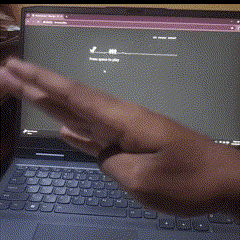
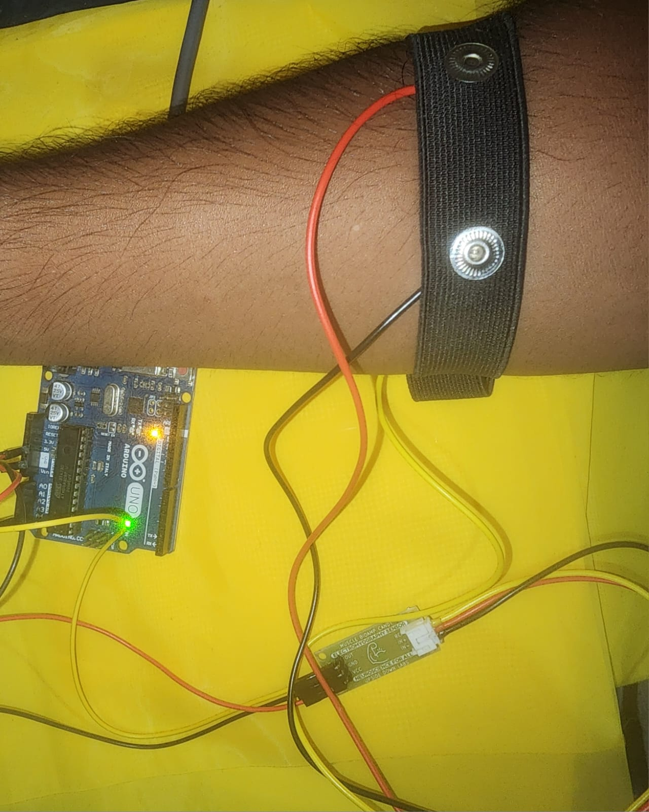

# 🦖 Dino Flex Therapy – An HCI-Based EMG Game for Rehabilitation  
### 🎮 Gamified Physiotherapy for Children with Cerebral Palsy using EMG + HCI

**Dino Flex Therapy** is a Human-Computer Interaction (HCI)–driven game controller designed to support **physiotherapy in children with cerebral palsy (CP)** using **electromyography (EMG)** signals. It turns the classic Chrome Dino game into an engaging rehab tool: children flex a muscle, and the dino jumps!

By using muscle signals instead of a keyboard, this project makes therapy **interactive, fun, and motivational**—especially for those with limited motor control.



---

## 👶 Who Is It For?

- 🧒 Children with **Cerebral Palsy** (especially upper limb involvement)
- 🧑‍⚕️ Physiotherapists and occupational therapists
- 🧑‍🏫 Educators teaching **HCI**, **biosignal interfaces**, or **assistive technology**
- 💻 Hobbyists and researchers in **EMG-based control systems**

---

## 💡 What Is HCI in This Context?

> **Human-Computer Interaction (HCI)** focuses on designing systems that allow intuitive, effective communication between humans and computers.  
> This project applies HCI by using **natural muscle movements** (via EMG) as input to control a **visual, game-based interface** (Chrome Dino), promoting physical engagement.

---

## 🧠 How It Works

1. An **EMG sensor** (BioAmp Candy) captures muscle activation.
2. **Arduino** detects the EMG spike and sends a signal (`"1"`) over serial USB.
3. A **Python script** on your PC listens to that signal.
4. When detected, it triggers a **jump action** in the Chrome Dino game using PyAutoGUI.

---

## 🔧 Hardware Used

- ✅ EMG Sensor (BioAmp Candy)
- ✅ Arduino Uno 
- ✅ PC with USB port
- ✅ Dry Electrode Band, jumper wires
- ✅ USB A  cable

<p align="center">
  
</p>

---

## 💻 Software Required

- Arduino IDE
- Python 3.x
- Chrome Browser
- Python Libraries:
  - `pyserial`
  - `pyautogui`

```bash
pip install pyserial pyautogui
